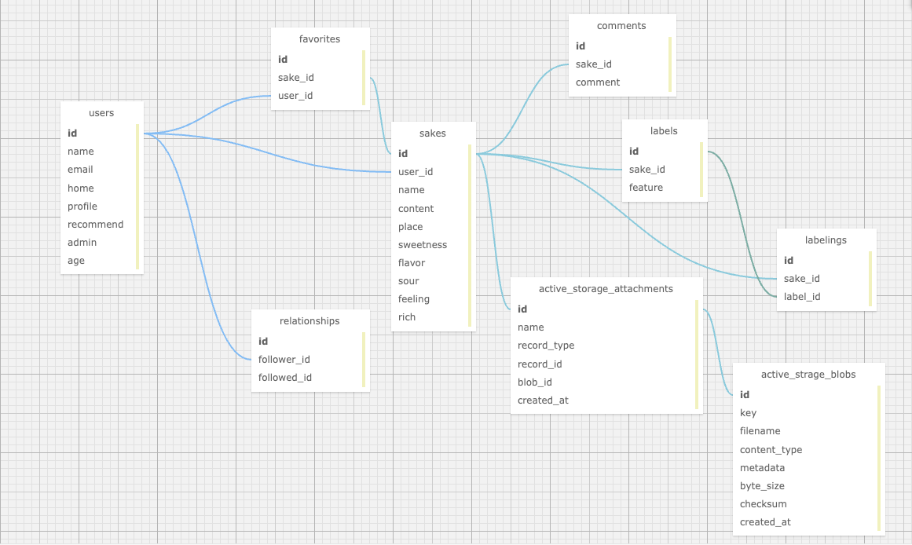
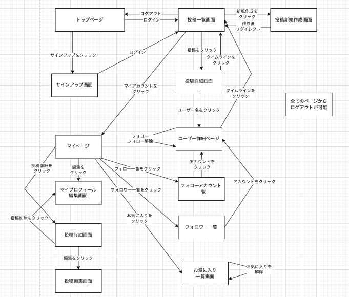

# README
# 開発言語
* Ruby 3.0.1
* Rails 6.1.6
# 就業Termの技術
* devise
* フォロー機能
* rails_admin
* cancancan
# カリキュラム外の技術
* Active Storage
* ransack
* Chart.js
# 実行手順
* $ git clone
* $ cd SyuMi
* $ bundle install
* $ yarn install
* $ rails db:create && rails db:migrate
* $ rails s
# カタログ設計
https://docs.google.com/spreadsheets/d/1eus7bcKAVqoutydejNR7-QtldQCxsvqiy3nOgp33huk/edit?usp=sharing
# テーブル定義書
https://docs.google.com/spreadsheets/d/1eus7bcKAVqoutydejNR7-QtldQCxsvqiy3nOgp33huk/edit?usp=sharing
# ワイヤーフレーム
https://cacoo.com/diagrams/CEY6j2A660QkvB72/7DD16
# ER図

# 画面遷移図

